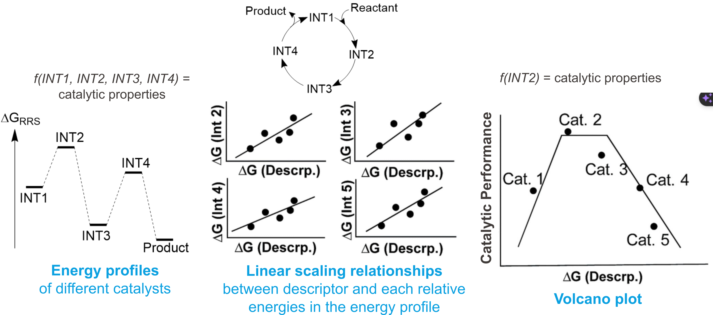
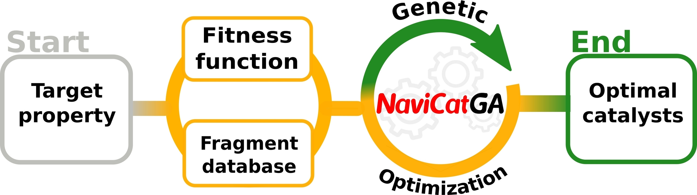

# Chemical design

While our group primarily focuses on "low-level" tasks like mechanistic studies and electronic structure elucidation, it's important to recognize that these foundational efforts lay the groundwork for more advanced research. However, the ability to extract design rules and develop superior catalysts can significantly enhance the impact of your work. By applying these insights, we can advance our understanding of catalysis and contribute to the development of more effective catalysts, ultimately making a more significant contribution to the field. 

## Theory stuff

### Molecular Volcano Plot

Molecular volcano plots 🌋 have emerged as powerful tools for the study of homogeneous catalysis. They provide a graphical representation of the relationship between catalytic properties (activity and selectivity) and a chosen descriptor, typically the relative energy of an intermediate in the reaction mechanism.

<!-- {width=200px height=150px style="border: 1px solid black;"} -->

  

Typically, determining catalytic properties requires computation of the entire free energy profile, involving numerous intermediate and transition states, exhaustive and time-consuming task! 😫

Molecular volcano plot is a step beyond the that. Instead of the free energy profile, you just need to determine one or two descriptors to determine the catalytic properties, simplifying the determination of catalytic performance, making it possible to conduct high-throughput screening of catalysts. Moreover, it offers a more comprehensive understanding of catalytic properties than just inspecting bunch of energy profiles.

As mentioned above, the chosen descriptor is typically an energetic one, namely the relative energy of the intermediate in the reaction mechanism. However, extracting chemical insights from such descriptors can be challenging. To address this, you can potentially correlate non-energetic descriptors with their energetic counterparts, possibly using multivariate linear regression from which the chemical insight can be extracted 🧪✨. These **non-energetic descriptors** can be computed with tools like [morfeus](https://digital-chemistry-laboratory.github.io/morfeus/), [RDKit](https://www.rdkit.org/), or [kallistro](https://ehjc.gitbook.io/kallisto/). Check out my paper how it is done (っ＾▿＾)💨.

  
  
Activity map describing the TOF for uLP-catalyzed CO2 hydrogenation as a function of the B-N distance and their relative orientation. Both are geometrical descriptor variables. Read more here: 10.1002/anie.202202727)

I personally have also combined the molecular volcano plot with microkinetic modelling (MKM) to build ***MKM volcano plot***. A coolest and possibly the ultimate form of volcano plot. Read my paper XD (っ＾▿＾)💨.

### Genetic Optimization

You can optimize your chemical structure towards target properties with genetic algorithm.

  
  
Schematic catalyst optimization pipeline powered by NaviCatGA. Taken from 10.1002/cmtd.202100107.

Read more here..
- [NaviCatGA](https://chemistry-europe.onlinelibrary.wiley.com/doi/full/10.1002/cmtd.202100107)

### Machine Learning

check out [quantum_machine_learning](../quantum_machine_learning/README.md) for more details.

### Good papers to read to be inspired
(30/10/2023)
I suggest you read these review papers (ranked by importance (my own view)) to be inspired and to get a sense of what is going on in the field (although note my date of writing, the field is changing all the time).
-  [Automated in Silico Design of Homogeneous Catalysts](https://pubs.acs.org/doi/10.1021/acscatal.9b04952)
- [Toward in silico Catalyst Optimization](https://www.chimia.ch/chimia/article/view/6270)
- [Data-driven discovery of organic electronic materials enabled by hybrid top-down/bottom-up design](https://chemrxiv.org/engage/chemrxiv/article-details/638a772292f084b6bd248b36)
- [Computational Discovery of Transition-metal Complexes: From High-throughput Screening to Machine Learning](https://pubs.acs.org/doi/full/10.1021/acs.chemrev.1c00347)
- [A Comprehensive Discovery Platform for Organophosphorus Ligands for Catalysis](https://pubs.acs.org/doi/full/10.1021/jacs.1c09718)

and you should be able to find more from here.....

## Resource and Program

Check out [LCMD's NaviCat platform](https://github.com/lcmd-epfl/NaviCat)  (platform for catalyst discovery) which consists of...

- [NaviCatGA](https://github.com/lcmd-epfl/NaviCatGA): Genetic algorithm for catalyst/chemical optimization
- [Volcanic](https://github.com/lcmd-epfl/volcanic): A program to automatically generate volcano plots for homogeneous catalysis.
- [mikimo](https://github.com/lcmd-epfl/mikimo) (by Me ヽ༼◥▶ل͜◀◤༽ﾉ ): A program to automatically perform microkinetic modeling and generate microkinetic volcano plots for homogeneous catalysis reactions

-------------------------------
Not in NaviCat platform but also useful
- [cell2mol](https://github.com/lcmd-epfl/cell2mol): Program that interprets .cif files of molecular crystals and retrieves structural, connectivity and charge information of all molecules present in the unit cell.

and check out those QML programs in the [QML](../quantum_machine_learning/README.md) folder as well.